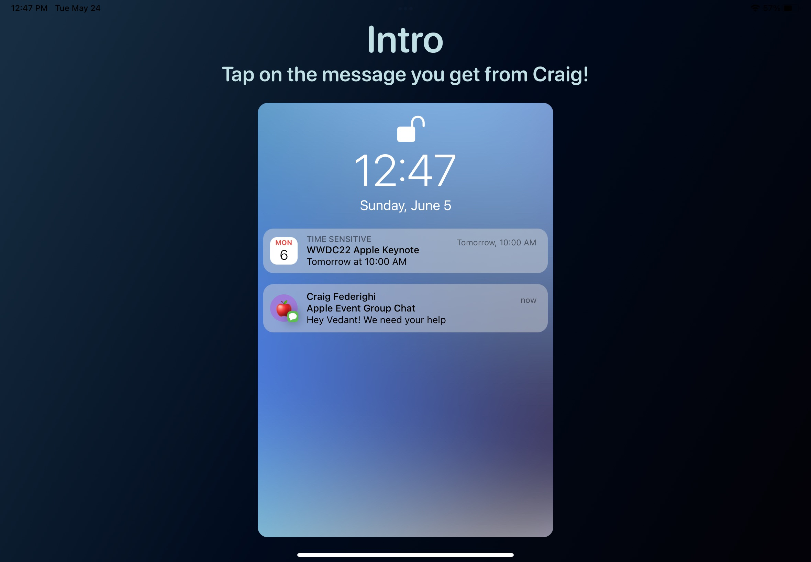
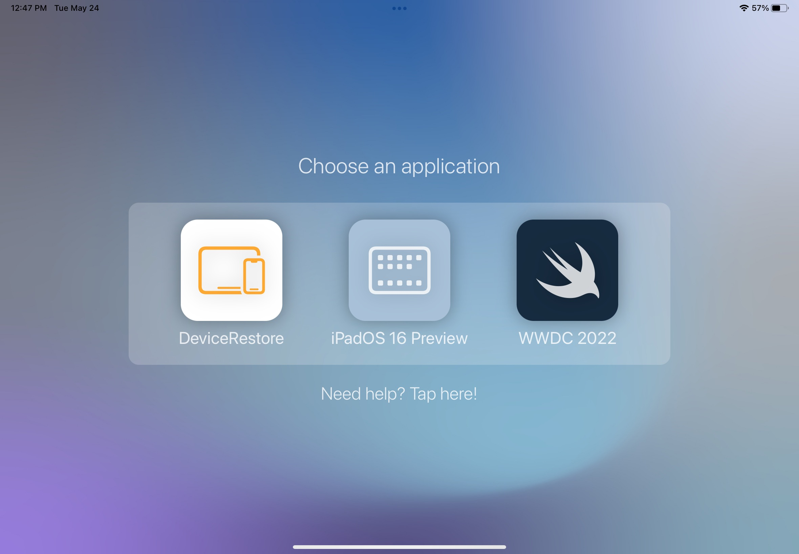
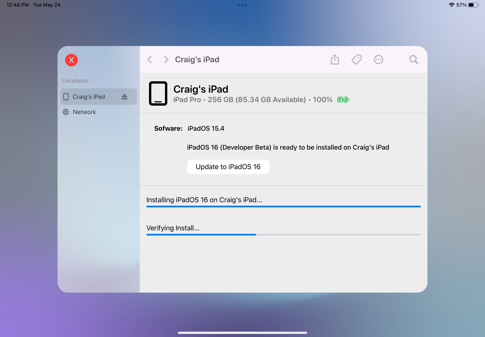
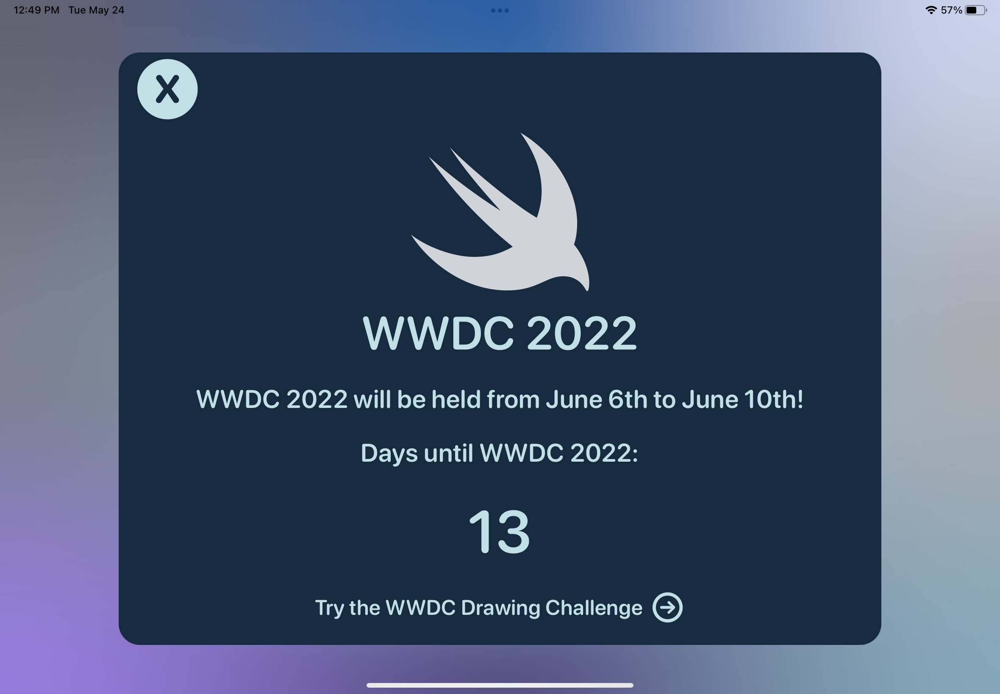
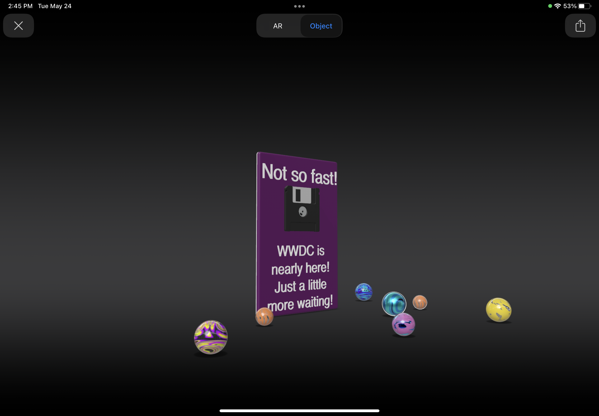
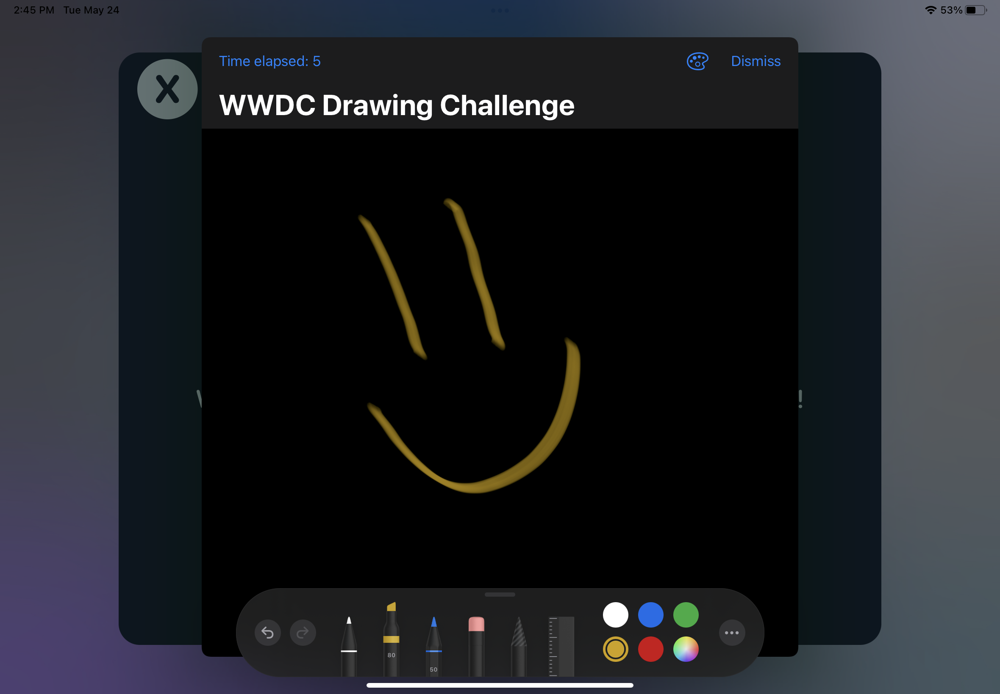

# SaveWWDC
My submission for the WWDC22 Swift Student Challenge!

## Status
[Accepted!](https://twitter.com/vedantapps/status/1529119758729195520?s=21&t=u2HnFlpK_nBo2hi4obln1A) 

## The Project
- SaveWWDC puts you on the task to save WWDC! 
- Help the Apple team out by using 'mini-apps' within the main app.
- The project uses SwiftUI, UIKit, ARKit, PencilKit, and QuickLook.

## Screenshots 

  
  
  
  
  
  

